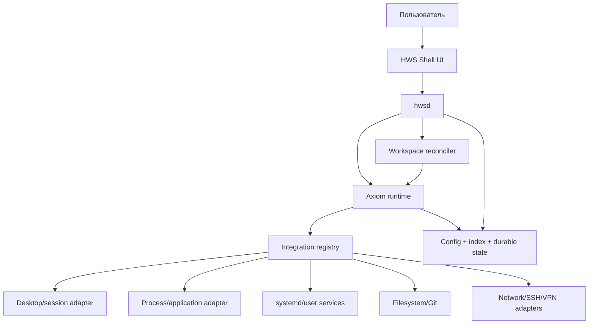

# Архитектура HWS

## 1. Назначение

Этот документ задаёт архитектурные границы HWS. Он должен описывать то, как система обязана быть разделена, а не детали конкретной реализации UI.

Главный принцип:

> UI выражает намерение пользователя. `hwsd` преобразует намерение в desired state. Axiom проверяет и оркестрирует значимые переходы. Интеграционные адаптеры воздействуют на ОС. Reconciler сравнивает desired и observed state.

## 2. Контекст системы



## 3. Процессы

### 3.1 `shell-ui`

Ответственность:

- визуализация иерархии;
- keyboard/mouse/touch navigation;
- Focus/Home modes;
- breadcrumbs/context stack;
- поиск;
- показ прогресса, ошибок и explain data;
- кэш представления дерева для мгновенной навигации.

Не имеет права:

- выполнять shell-команды;
- напрямую запускать системные операции;
- хранить authoritative durable workspace state;
- принимать решения о retry/recovery критичных действий.

### 3.2 `hwsd`

Главный пользовательский daemon на Go.

Ответственность:

- domain services;
- context hierarchy;
- workspace definitions;
- desired/observed state;
- Axiom engine lifecycle;
- integrations registry;
- reconciliation;
- индекс и search;
- diagnostics;
- IPC API.

`hwsd` не должен требовать root для штатной работы.

### 3.3 Привилегированный helper

Не входит в MVP. Если появятся действия, требующие повышенных прав, они должны быть вынесены в минимальный отдельно проектируемый helper с узким versioned API. Нельзя просто запускать весь `hwsd` от root.

## 4. Слои Go-кода

Рекомендуемая структура:

```text
cmd/
  hwsd/
  hwsctl/

internal/
  domain/
    context/
    workspace/
    resource/
  application/
    contextservice/
    workspaceservice/
    searchservice/
  orchestration/
    axiomruntime/
    models/
    activities/
  reconcile/
  integrations/
    desktop/
    process/
    systemd/
    filesystem/
    git/
    ssh/
    network/
  ipc/
  storage/
  telemetry/
  config/
```

### Dependency rule

```text
integration adapters
        ↑
application/orchestration
        ↑
domain
```

`domain` не импортирует GNOME, D-Bus, Axiom store implementation, Git CLI или systemd types.

Axiom-модели относятся к orchestration/application boundary. Базовые domain types должны оставаться пригодными для unit/property testing без запуска runtime.

## 5. Domain model

### 5.1 Context Node

Минимальный контракт:

```go
type Node struct {
    ID       NodeID
    Kind     NodeKind
    ParentID *NodeID
    Title    string
    Order    int
    Target   TargetRef
    Metadata Metadata
}
```

`NodeID` стабилен и не должен зависеть от локализованного title.

### 5.2 Selection Path

```text
root / area / project / task / action
```

Selection path — immutable value на момент выбора. Изменение дерева не должно незаметно переинтерпретировать уже запущенную durable operation.

Для запуска операции `hwsd` формирует snapshot необходимых ссылок/версий.

### 5.3 Workspace Definition

Workspace описывает намерение, а не текущую ОС:

```text
WorkspaceDefinition
├── identity
├── resources[]
├── layout intent
├── environment intent
├── capabilities required
├── startup policy
├── shutdown policy
└── recovery policy
```

### 5.4 Resource

Типы ресурсов могут включать:

- application/process;
- window intent;
- terminal session;
- directory/project;
- service;
- remote connection;
- network profile;
- document/url;
- background provider.

Каждый ресурс имеет ownership mode:

- `managed` — создан HWS и может управляться HWS;
- `adopted` — существовал до HWS, но временно включён в workspace;
- `external` — наблюдается, но не управляется.

Это поле критично для безопасного shutdown.

## 6. Desired vs observed

HWS не должен считать операцию завершённой только потому, что команда запуска была отправлена.

```text
Desired state
     ↓
Reconciler
     ↓
Integration adapters
     ↓
Observed state
     ↓
Diff / convergence decision
```

Пример:

```text
Desired:
  editor: running
  cwd: /repo/HWS
  terminal: running
  layout: editor-left terminal-right

Observed:
  editor: running
  cwd: /repo/HWS
  terminal: missing
  layout: partial
```

Результат не `Active`, а `Degraded`/`Preparing` в зависимости от policy и возможности восстановления.

## 7. Reconciliation

Reconciler должен быть детерминированным для одинаковых входных snapshot.

Алгоритм верхнего уровня:

1. прочитать workspace definition;
2. получить capability snapshot;
3. построить desired state;
4. получить observed state;
5. вычислить diff;
6. сформировать набор intents/activities;
7. провести значимый переход через Axiom;
8. выполнить activities;
9. повторно измерить observed state;
10. определить convergence/degraded/failure.

Reconciliation не означает безусловное уничтожение всего, что не соответствует desired state. Ownership и policy имеют приоритет.

## 8. Axiom boundary

Axiom применяется к операциям, где важны:

- допустимые переходы;
- claims/invariants;
- durable history;
- retry/backoff/timeout;
- idempotency;
- replay/explain;
- recovery после process restart.

Примеры execution ID:

```text
workspace:<workspace-id>
connection:<connection-id>
operation:<operation-id>
```

Нельзя создавать durable execution на каждое движение фокуса или выделение плитки.

Подробности: [AXIOM_INTEGRATION.md](AXIOM_INTEGRATION.md).

## 9. IPC

Публичный локальный API должен быть versioned независимо от внутренней Go-структуры.

Черновые методы:

```text
Context.GetTree
Context.Select
Context.GetPath
Workspace.Activate
Workspace.Suspend
Workspace.Resume
Workspace.Close
Workspace.GetState
Workspace.Explain
Workspace.GetHistory
Search.Query
System.GetCapabilities
Diagnostics.GetHealth
```

UI не должен импортировать внутренние Go-модели как контракт сериализации без versioning layer.

## 10. Desktop adapter

Desktop-specific возможности находятся за интерфейсами, например:

```go
type WindowManager interface {
    ListWindows(ctx context.Context) ([]Window, error)
    ApplyLayout(ctx context.Context, in LayoutIntent) (LayoutResult, error)
    Focus(ctx context.Context, id WindowID) error
}
```

Это позволяет:

- тестировать domain/reconciler с fake adapter;
- заменять способ интеграции с GNOME;
- не заражать core desktop-specific типами;
- создать fallback capabilities.

## 11. Capability model

HWS не должен предполагать, что каждая функция доступна в каждой сессии.

Примеры capabilities:

```text
window.list
window.move
window.resize
window.workspace.assign
app.launch
app.activate
systemd.user
ssh.connect
network.profile.activate
```

Workspace может объявлять:

- required capability;
- preferred capability;
- fallback.

Недоступность required capability должна приводить к объяснимому отказу или Degraded state согласно policy.

## 12. Persistence

Разные данные имеют разные требования:

| Данные | Характер |
|---|---|
| UI hover/animation | ephemeral |
| cached tree projection | rebuildable |
| user hierarchy/config | durable |
| workspace definition | durable |
| Axiom execution/history | durable для production path |
| search index | rebuildable |
| observed state | snapshot/cache, перепроверяется |
| diagnostics | bounded retention |

Нельзя использовать один универсальный blob как единственный источник всех состояний.

## 13. Failure model

Минимально различаются:

- validation failure;
- capability unavailable;
- activity transient failure;
- activity permanent failure;
- observed-state mismatch;
- timeout;
- cancellation;
- storage failure;
- IPC disconnect;
- daemon restart;
- integration adapter crash/error.

Каждый класс должен иметь явную семантику recovery.

## 14. Observability

Каждое значимое пользовательское намерение получает correlation ID.

```text
intent
  → workspace operation
    → axiom execution
      → activity attempt
        → integration call
```

Логи должны позволять восстановить эту цепочку без включения debug-режима заранее.

## 15. Эволюция архитектуры

Переход к собственному compositor/window manager допускается только если измеримые ограничения существующего integration layer делают ключевые продуктовые сценарии невозможными. Такое решение требует отдельного ADR с прототипом, migration plan и сравнением стоимости владения.