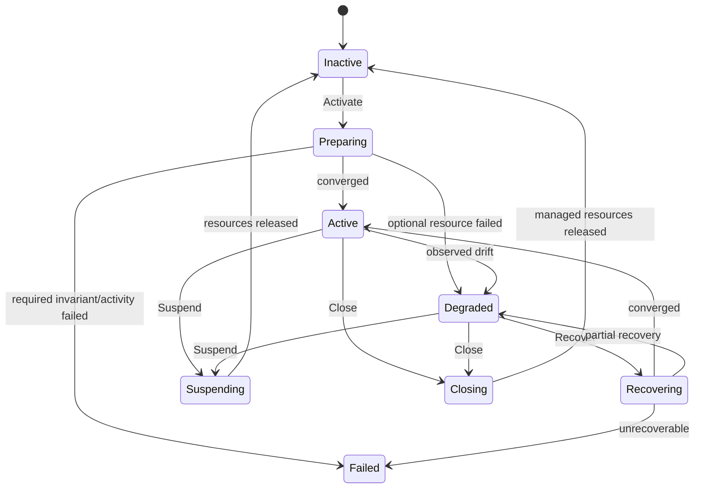

# Интеграция Axiom в HWS

## 1. Решение

HWS использует `github.com/Homiakus/axiom` как runtime проверяемых значимых переходов состояния и orchestration внешних действий.

Для нового Go-кода основной frontend — declarative `model` API.

HWS **не** использует Axiom как универсальный reactive store интерфейса. Эфемерные действия пользователя (hover, раскрытие строки, изменение визуального selection до подтверждения, animation progress) не должны создавать durable execution.

## 2. Почему Axiom подходит HWS

Рабочее окружение — это не просто набор окон. Его активация может включать:

- проверку доступных capabilities;
- запуск процессов;
- ожидание появления окон;
- размещение окон;
- запуск user services;
- подключение к SSH;
- включение сетевого профиля;
- открытие проекта;
- повтор после transient failure;
- восстановление после рестарта daemon.

Такая операция имеет состояния, инварианты, внешние эффекты и частичные отказы. Поэтому она должна быть моделирована явно.

## 3. Integration package

Axiom изолируется внутри HWS:

```text
internal/orchestration/axiomruntime/
internal/orchestration/models/
internal/orchestration/activities/
```

Остальной application layer не должен разбрасывать вызовы Axiom по всему проекту.

Предпочтительный фасад:

```go
type WorkspaceOrchestrator interface {
    Activate(ctx context.Context, req ActivateRequest) error
    Suspend(ctx context.Context, workspaceID WorkspaceID) error
    Resume(ctx context.Context, workspaceID WorkspaceID) error
    Close(ctx context.Context, workspaceID WorkspaceID) error
    Recover(ctx context.Context, workspaceID WorkspaceID) error
    State(ctx context.Context, workspaceID WorkspaceID) (LifecycleState, error)
    Explain(ctx context.Context, workspaceID WorkspaceID) (Explanation, error)
}
```

## 4. Workspace lifecycle

Начальная модель:



`Suspending` и `Closing` могут позднее быть разведены по более строгой семантике. До реализации они должны оставаться явно описанными, а не сливаться в один неформальный `stop`.

## 5. Состояние

Черновой state object:

```go
type WorkspaceLifecycleState struct {
    Phase              string
    DefinitionVersion  string
    DesiredRevision    string
    ObservedRevision   string
    CapabilityRevision string
    LastOperationID    string
    DegradedReasons    []string
    LastErrorCode      string
}
```

В Axiom-модель следует помещать только данные, которые нужны для правил, claims, recovery и объяснения. Большие observed snapshots или UI-модели могут храниться отдельно и связываться revision/hash.

## 6. Events

Минимальный набор:

```go
type Activate struct {
    OperationID       string
    DefinitionVersion string
}

type Reconcile struct {
    OperationID      string
    DesiredRevision  string
    ObservedRevision string
}

type Suspend struct{ OperationID string }
type Resume struct{ OperationID string }
type Close struct{ OperationID string }
type Recover struct{ OperationID string }
```

Внутренние completion/failure events должны быть типизированными и не подменяться общим `map[string]any` без необходимости.

## 7. Claims / инварианты

Примеры claims:

- нельзя перейти в `Active`, если не подтверждены required resources;
- нельзя закрывать `adopted`/`external` resource как managed;
- нельзя применять layout к window, ownership/identity которого не подтверждены;
- privileged action требует явной разрешённой capability/policy;
- definition revision должна соответствовать операции, либо должен быть явный migration/re-resolve;
- operation ID не пустой;
- terminal failure не должен быть представлен как `Active`.

Claims должны защищать корректность модели, а не заменять всю авторизацию приложения.

## 8. Activities

OS side effects регистрируются как typed Axiom activities.

Примеры:

```text
EnsureApplication
EnsureTerminal
EnsureUserService
EnsureRemoteConnection
EnsureNetworkProfile
WaitForWindow
ApplyWindowLayout
ReleaseManagedResource
CaptureObservedState
```

Каждая activity должна иметь:

- typed input/output;
- timeout policy;
- retry policy, если retry безопасен;
- idempotency key;
- классификацию ошибок;
- ownership semantics;
- observability fields;
- тест с повторным выполнением.

## 9. Idempotency

Axiom durable retry не превращает внешний эффект в exactly-once. Поэтому HWS обязан проектировать activity boundary как at-least-once-safe там, где это возможно.

Пример ключа:

```text
workspace:<id>:resource:<resource-id>:ensure:<desired-revision>
```

### EnsureApplication

Нельзя реализовывать как:

```text
каждый retry → всегда запусти новый процесс
```

Нужно:

1. найти уже подходящий managed/adoptable процесс;
2. проверить identity;
3. только если его нет — создать;
4. вернуть stable resource handle/identity;
5. повторное выполнение должно обнаружить созданный ресурс.

### ApplyWindowLayout

Повторное применение одной и той же абсолютной layout intent должно быть безопасным. Если API desktop layer не позволяет это гарантировать, activity должна явно помечаться как best-effort и после неё обязательно выполняется observed-state verification.

## 10. Retry

Retry допустим для transient failures:

- временно не появился window;
- user service ещё запускается;
- временный IPC timeout;
- кратковременная недоступность локальной интеграции.

Retry не должен автоматически применяться к:

- permission denied, требующему изменения policy;
- invalid definition;
- отсутствующей required capability;
- неподтверждённому destructive action;
- внешнему side effect без идемпотентной модели.

Классификация ошибки должна выполняться в activity/integration boundary.

## 11. Durable store

Для production path HWS должен использовать transactional durable store, поддерживаемый Axiom.

Memory store разрешён для:

- unit tests;
- быстрых integration tests;
- dev demo, где потеря execution state явно допустима.

Memory store не должен незаметно стать production default для workspace orchestration.

## 12. Versioning Axiom

Axiom до стабильного `v1` рассматривается HWS как эволюционирующая зависимость.

Политика HWS:

1. импортировать Axiom только через локальный integration layer;
2. закреплять конкретную совместимую версию/pseudo-version в `go.mod`;
3. не обновлять Axiom автоматически без тестов HWS;
4. иметь contract tests на ключевые semantics;
5. при обновлении проверять migration/replay compatibility;
6. не экспортировать типы Axiom через публичный IPC HWS.

## 13. Execution identity

Один workspace должен иметь понятную стратегию execution ID.

Начальная рекомендация:

```text
workspace:<workspace-id>
```

Долгоживущий execution хранит lifecycle данного workspace.

Одноразовые операции, которые не должны сливаться с lifecycle, могут получать:

```text
operation:<uuid>
```

Но их количество нужно контролировать, чтобы не превратить историю в неуправляемый event dump.

## 14. Desired/observed revisions

Axiom не должен хранить огромный desktop snapshot только ради сравнения.

Reconciler формирует каноническое представление и revision:

```text
DesiredSnapshot  → canonical encode → hash/revision
ObservedSnapshot → canonical encode → hash/revision
```

Axiom lifecycle хранит revisions и критичные признаки convergence/degradation.

Полные snapshots могут храниться в workspace storage с bounded history.

## 15. Explainability

`Run.Explain`/history должны быть доступны через HWS application API.

UI должен уметь показать не только:

```text
Workspace failed
```

а:

```text
Workspace: HWS/Develop
Phase: Degraded
Required resources: 2/2
Optional resources: 1/2
Reason: window.move capability unavailable
Last successful activity: EnsureTerminal
Blocked operation: ApplyWindowLayout
```

Формат UI не обязан совпадать с внутренним Axiom explanation type.

## 16. Recovery

После старта `hwsd`:

1. открыть durable store;
2. найти workspace executions, не находящиеся в чистом inactive/terminal состоянии;
3. повторно измерить desktop observed state;
4. не доверять старому observed snapshot как факту;
5. сформировать recovery intent;
6. продолжить/скорректировать lifecycle через Axiom;
7. не уничтожать неизвестные процессы ради восстановления.

## 17. Cancellation

Пользователь может отменить долгую активацию.

Cancellation означает:

- прекратить новые activities;
- по возможности отменить context-aware running activities;
- не считать внешний side effect откатившимся только из-за cancel;
- измерить observed state;
- определить, какие managed resources реально созданы;
- перейти в корректный partial/inactive/degraded state согласно модели.

## 18. Что Axiom не решает за HWS

Axiom не заменяет:

- desktop API;
- D-Bus transport;
- process identity;
- security authorization;
- distributed locks;
- secrets management;
- capability discovery;
- UI reactive state;
- exactly-once внешний эффект;
- корректный ownership ресурсов.

Эти границы должны оставаться явными.

## 19. Минимальный prototype test matrix

| Сценарий | Ожидание |
|---|---|
| Activate с чистой системой | Active |
| Activate повторно | без дубликатов |
| editor уже запущен | adopt/reuse по policy |
| terminal activity transient fail | retry |
| required capability отсутствует | explainable failure/degraded |
| daemon restart между activities | recovery продолжает корректно |
| activity завершилась, checkpoint упал | повтор безопасен за счёт idempotency |
| user cancels activation | observed state перечитывается |
| Close с adopted process | процесс не убивается без policy |
| history replay | состояние/объяснение согласованы |

## 20. Первый кодовый артефакт

Перед подключением реальных GNOME/system APIs следует реализовать Axiom-модель workspace lifecycle с fake activities и fault injection. Если модель не выдерживает повтор, restart и partial failure на fake boundary, подключать реальные side effects рано.