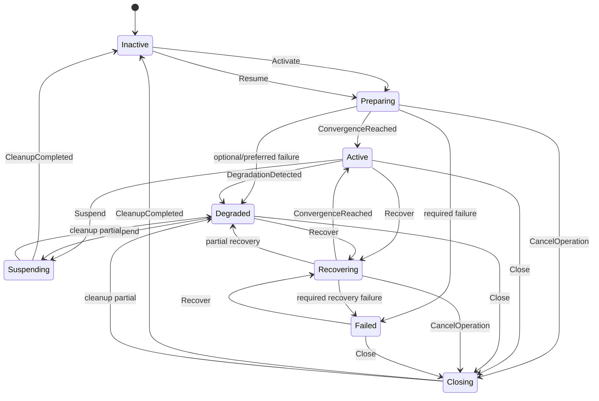

# HWS Workspace Lifecycle

Статус: Proposed formal model для первой реализации на Axiom.

## 1. Назначение

Документ фиксирует lifecycle одного workspace так, чтобы его можно было непосредственно реализовать через `github.com/Homiakus/axiom/model` и проверить тестами до подключения реальных desktop side effects.

## 2. Состояния

```text
Inactive
Preparing
Active
Degraded
Recovering
Suspending
Closing
Failed
```

### Inactive

Workspace не считается активным. Managed resources могут отсутствовать. Наличие adopted/external ресурсов не меняет фазу само по себе.

### Preparing

Идёт достижение desired state после Activate/Resume.

### Active

Все required условия выполнены, observed state подтверждает готовность.

### Degraded

Workspace пригоден к работе частично, но есть отклонения. Причины должны быть сохранены и объяснимы.

### Recovering

После drift/restart/failure выполняется контролируемое восстановление.

### Suspending

HWS уменьшает/останавливает managed activity, сохраняя контекст для последующего Resume согласно policy.

### Closing

HWS освобождает managed resources и завершает lifecycle-операцию.

### Failed

Продолжение текущей операции невозможно без нового пользовательского/системного решения.

## 3. Events

Внешние:

```text
Activate
Suspend
Resume
Close
Recover
ReconcileRequested
CancelOperation
```

Внутренние/system-driven:

```text
CapabilitiesResolved
DesiredStateBuilt
ResourceEnsured
ResourceEnsureFailed
ObservedStateCaptured
ConvergenceReached
DegradationDetected
RecoveryFailed
CleanupCompleted
```

Конкретная реализация может агрегировать несколько внутренних событий, но переходы должны оставаться тестируемыми.

## 4. Основная диаграмма



## 5. Canonical lifecycle state

Предлагаемый state для Axiom:

```go
type Lifecycle struct {
    Phase              string   `json:"phase"`
    WorkspaceID        string   `json:"workspaceId"`
    DefinitionVersion  string   `json:"definitionVersion"`
    DesiredRevision    string   `json:"desiredRevision"`
    ObservedRevision   string   `json:"observedRevision"`
    CapabilityRevision string   `json:"capabilityRevision"`
    OperationID        string   `json:"operationId"`
    DegradedReasons    []string `json:"degradedReasons"`
    LastErrorCode      string   `json:"lastErrorCode"`
}
```

Если Axiom declarative model не поддерживает конкретную форму slice-операций удобно/безопасно, degraded details допускается хранить отдельно, а в lifecycle — агрегированный код/revision. Это нужно подтвердить прототипом, а не предполагать.

## 6. Claims

### C1. Workspace ID задан

Ни одно execution не существует без stable workspace identity.

### C2. Active требует revisions

В `Active` должны быть известны как минимум:

- desired revision;
- observed revision;
- capability revision.

### C3. Active требует convergence

Переход в Active разрешён только после explicit convergence result для required resources.

### C4. Failed не маскируется

Если `LastErrorCode` относится к terminal required failure текущей операции, phase не может оставаться `Active`.

### C5. Operation ID обязателен для side-effect transition

Activate/Suspend/Resume/Close/Recover должны иметь непустой OperationID.

### C6. Definition version фиксируется на операцию

Нельзя молча сменить definition version внутри Preparing/Recovering без явного re-resolve/migration event.

## 7. Activities первой версии

```text
ResolveCapabilities
BuildDesiredState
CaptureObservedState
EnsureResources
EnsureLayout
ReleaseResources
CaptureFinalObservedState
```

Для более строгой идемпотентности `EnsureResources` вероятно будет разложена на activity на один ресурс. Это предпочтительный путь после первого прототипа.

## 8. Activity contracts

### ResolveCapabilities

Input:

```text
workspace id
operation id
```

Output:

```text
capability revision
required missing[]
preferred missing[]
```

Не выполняет destructive side effects.

### BuildDesiredState

Должна быть pure или почти pure application operation. Если она не требует durable retry, её можно выполнить до dispatch и передать revision/event. Решение требуется подтвердить на прототипе.

### CaptureObservedState

Read-only activity. Повтор безопасен. Результат timestamped/revisioned.

### EnsureResource

Input обязан содержать:

```text
workspace id
resource id
desired revision
operation id
```

Idempotency key:

```text
workspace:<ws>:resource:<res>:ensure:<desired-revision>
```

### EnsureLayout

Повтор одной layout intent должен быть безопасен насколько позволяет adapter. После выполнения обязательно повторное наблюдение.

### ReleaseResource

Выполняется только для resource, policy которого разрешает release и ownership подтверждён как managed либо явно разрешённый adopted.

## 9. Порядок Activate

```text
Activate
  ↓
validate request
  ↓
ResolveCapabilities
  ↓
required capabilities available?
  ├─ no → Failed/Degraded by policy
  ↓ yes
Build/resolve desired revision
  ↓
CaptureObservedState
  ↓
diff
  ↓
EnsureResource(s)
  ↓
EnsureLayout
  ↓
CaptureObservedState
  ↓
required convergence?
  ├─ yes → Active
  ├─ partial → Degraded
  └─ no → Failed
```

## 10. Повторный Activate

Repeated Activate одного workspace не должен безусловно запускать lifecycle с нуля.

Начальная политика:

- если Active и desired definition revision та же — выполнить lightweight reconcile/focus path;
- если Degraded — предложить/запустить Recover согласно policy;
- если Preparing/Recovering — присоединиться к существующей operation/status, не создавать конфликтующий side-effect execution;
- если definition version изменилась — сформировать новую operation с явным update/reconcile semantics.

## 11. Suspend vs Close

До M1 фиксируется различие намерений.

Suspend:

- сохранить workspace как возобновляемый контекст;
- release только ресурсы, для которых suspend policy это допускает;
- не удалять durable user context.

Close:

- завершить активное окружение;
- release managed resources согласно shutdown policy;
- оставить definition/history, но lifecycle вернуть в Inactive после подтверждённого cleanup.

## 12. Degraded

Degraded не является универсальной корзиной ошибок.

Причина должна классифицироваться:

```text
missing_preferred_resource
missing_optional_resource
layout_partial
observed_drift
cleanup_partial
capability_lost
remote_temporarily_unavailable
```

Required invariant failure обычно ведёт в Failed, если policy явно не разрешает degraded operation.

## 13. Crash recovery

После старта daemon:

```text
load lifecycle execution
  ↓
phase ∈ Preparing/Recovering/Suspending/Closing/Degraded/Active?
  ↓ yes
capture fresh observed state
  ↓
compare with desired + lifecycle history
  ↓
Recover/Reconcile decision
```

Особенно важно: нельзя считать activity невыполненной только потому, что completion checkpoint отсутствует. Внешний side effect мог произойти до crash. Поэтому recovery всегда сначала наблюдает фактическое состояние и использует idempotent ensure semantics.

## 14. CancelOperation

Cancel не делает rollback автоматически.

Алгоритм:

1. запретить scheduling новых activities;
2. отменить context-aware операции, где возможно;
3. дождаться/зафиксировать исход running activity согласно runtime semantics;
4. перечитать observed state;
5. определить реальные managed resources;
6. выполнить безопасный cleanup, если policy это требует;
7. перейти в Inactive/Degraded/Failed согласно факту.

## 15. History expectations

Для диагностики должны быть восстановимы как минимум:

- кто/что инициировал операцию;
- operation ID;
- definition version;
- desired/observed revisions;
- какие activities планировались;
- attempts/retry;
- какие ошибки возникли;
- чем завершился convergence check.

## 16. Test cases до реальной desktop integration

Обязательные fake-runtime tests:

1. clean Activate → Active;
2. repeated Activate → no duplicate resource;
3. transient EnsureResource failure → retry → Active;
4. permanent required failure → Failed;
5. optional failure → Degraded;
6. crash after side effect before checkpoint → recover without duplicate;
7. crash during Preparing → fresh observe → continue;
8. Cancel during EnsureResource → no false rollback assumption;
9. Close releases only managed;
10. adopted resource survives Close;
11. capability missing before action → no unsafe activity;
12. observed drift from Active → Degraded;
13. Recover from Degraded → Active;
14. changed definition during Preparing does not silently replace snapshot;
15. Explain/history contains blocking reason.

## 17. Следующий шаг реализации

Создать пакет `internal/orchestration/models/workspace` с declarative Axiom definition и fake activities. До прохождения перечисленных тестов реальный desktop adapter не подключать.